# VeriQore

### Blockchain-Based Academic Certificate Verification System

VeriQore is a full-stack blockchain-based certificate verification platform that enables educational institutions to issue secure digital certificates and allows recruiters to instantly verify certificate authenticity using blockchain technology.

The platform combines **SHA-256 cryptographic hashing**, **Ethereum blockchain**, **Solidity smart contracts**, **Cloudinary cloud storage**, **MongoDB Atlas**, and **JWT-based role authentication** to create a secure, transparent, scalable, and tamper-resistant certificate verification ecosystem.

---

## 🌐 Live Demo

**Application**

https://veriqore.vercel.app

---

# ✨ Key Features

| Feature                     | Description                                                              |
| --------------------------- | ------------------------------------------------------------------------ |
| 🔐 SHA-256 Hashing          | Generates a unique digital fingerprint for every certificate             |
| ⛓️ Ethereum Blockchain      | Stores immutable certificate hashes on Ethereum Sepolia                  |
| 📄 Certificate Verification | Instantly verifies certificate authenticity                              |
| ☁️ Cloudinary Storage       | Securely stores original certificate PDFs                                |
| 👥 Role-Based Access        | Separate portals for Master Admin, College Admin, Student, and Recruiter |
| 📜 Verification History     | Records recruiter verification activities                                |
| 🛡️ JWT Authentication       | Protects API endpoints and user sessions                                 |
| 🚫 Duplicate Detection      | Prevents duplicate certificate uploads before blockchain storage         |

---

# 📖 Overview

Academic certificate fraud has become a significant challenge for educational institutions, students, and recruiters. Traditional verification methods often require manual communication with institutions, resulting in long verification times, administrative overhead, increased operational costs, and opportunities for certificate forgery.

VeriQore addresses these challenges by introducing a blockchain-powered certificate verification platform that combines cryptographic hashing, decentralized blockchain technology, secure cloud storage, and role-based authentication.

The platform enables educational institutions to issue secure academic certificates, allows students to access and monitor their certificates, and provides recruiters with an instant method to verify certificate authenticity without contacting the issuing institution.

VeriQore is developed using modern full-stack technologies including React.js, Node.js, Express.js, MongoDB Atlas, Cloudinary, Solidity Smart Contracts, Ethereum Sepolia, MetaMask, Web3.js, JWT Authentication, and SHA-256 Hashing.

---

# 🏗️ System Architecture

The following architecture diagram illustrates the complete VeriQore workflow, including certificate issuance, SHA-256 hashing, blockchain storage, cloud storage, smart contract interaction, database management, and certificate verification.

<p align="center">
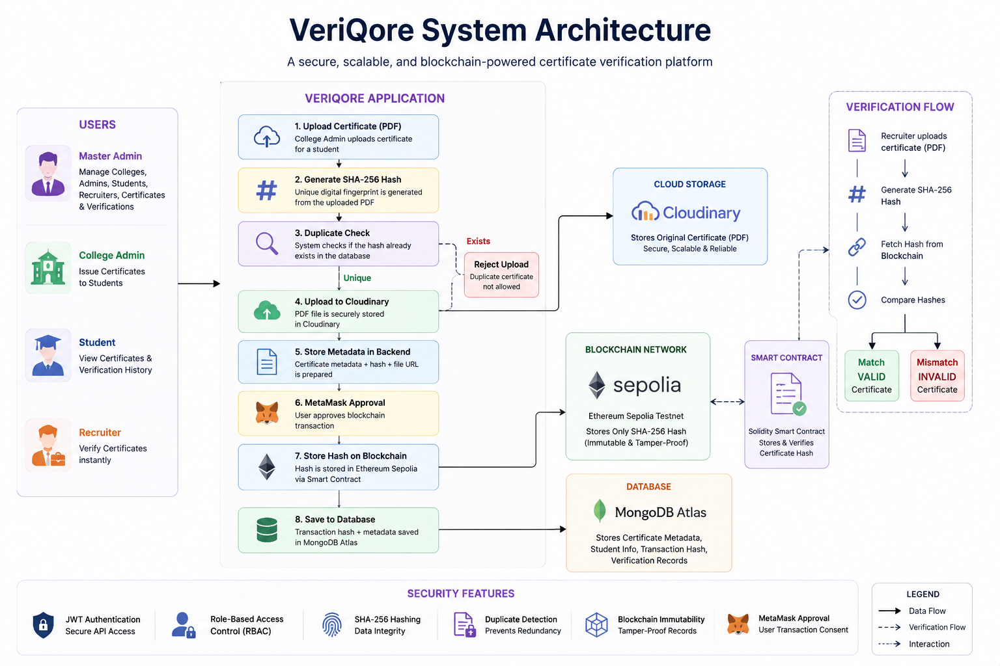
</p>

The architecture combines multiple technologies to provide an end-to-end certificate verification solution.

### Cloudinary

Stores the original certificate PDF securely.

### SHA-256

Generates a unique cryptographic fingerprint for every uploaded certificate.

### Ethereum Sepolia Blockchain

Stores immutable certificate hashes using Solidity Smart Contracts.

### MongoDB Atlas

Stores certificate metadata, blockchain transaction references, user information, verification history, and application data.

### MetaMask

Requests user authorization before blockchain transactions are executed.

Together these components provide a secure, transparent, and tamper-resistant certificate verification platform.

---

# ❓ Problem Statement

Academic certificate verification continues to rely heavily on manual validation from educational institutions.

This traditional approach introduces several challenges:

- Manual verification process
- Long processing time
- Administrative workload
- Risk of forged certificates
- Lack of transparency
- Difficulty verifying certificates internationally

VeriQore solves these problems by introducing blockchain-backed certificate verification, allowing recruiters to verify certificate authenticity instantly through cryptographic fingerprint comparison.

---

# 🎯 Project Objectives

The primary objectives of VeriQore are:

- Prevent academic certificate forgery
- Detect certificate tampering instantly
- Eliminate manual certificate verification
- Provide blockchain-backed transparency
- Secure certificate issuance
- Enable trusted recruiter verification
- Reduce blockchain storage cost by storing only certificate hashes
- Create a scalable and secure verification platform

---

# 🚀 Core Features

## Blockchain Certificate Issuance

Educational institutions can securely issue digital certificates to students.

Each certificate receives a blockchain-backed verification record, ensuring long-term authenticity and transparency.

---

## SHA-256 Certificate Hashing

Every uploaded certificate is processed using the SHA-256 cryptographic hashing algorithm.

Instead of storing or verifying certificates using the:

- File Name
- File Size
- Upload Date
- File Location

VeriQore verifies the **actual contents of the certificate**.

The generated SHA-256 hash acts as a unique digital fingerprint.

If even a single character changes within the certificate, an entirely different hash is generated.

This makes SHA-256 highly effective for detecting certificate tampering.

---

## Ethereum Blockchain Verification

Certificate hashes are permanently stored on the Ethereum Sepolia blockchain through Solidity Smart Contracts.

Blockchain storage provides:

- Immutability
- Transparency
- Public Verification
- Tamper Resistance

Because only the certificate fingerprint is stored on-chain, blockchain storage costs remain low while maintaining document integrity.

---

## Smart Contract Integration

VeriQore integrates a Solidity Smart Contract responsible for blockchain certificate registration.

Responsibilities include:

- Storing SHA-256 certificate hashes
- Maintaining immutable certificate records
- Returning stored hashes during verification
- Providing blockchain-backed proof of authenticity

Smart Contract:

**CertificateVerification.sol**

---

## Cloudinary Integration

The original certificate PDF is securely stored using Cloudinary cloud storage.

Instead of storing large PDF files on-chain, VeriQore stores only the SHA-256 fingerprint on Ethereum.

Benefits include:

- Lower blockchain cost
- Faster blockchain transactions
- Improved scalability
- Secure document storage

---

## Role-Based Access Control

VeriQore supports four independent user roles.

- Master Administrator
- College Administrator
- Student
- Recruiter

Each role has dedicated dashboards, permissions, protected routes, and access controls enforced using JWT authentication.

---

## Verification History

Every certificate verification performed by recruiters is securely recorded.

Students can monitor:

- Who verified the certificate
- Verification result
- Verification date
- Recruiter information

This improves transparency and accountability.

---

## Custom Error Handling

VeriQore includes dedicated error pages for improved usability and security.

Supported pages include:

- 401 Unauthorized
- 403 Forbidden
- 404 Not Found
- 500 Internal Server Error

---

# 🔐 SHA-256 Hashing Workflow

One of the core technologies used in VeriQore is **SHA-256 Cryptographic Hashing**.

SHA-256 can be thought of as a **unique digital fingerprint** of a certificate.

When a College Administrator uploads a certificate PDF, VeriQore reads the **actual contents** of the document, including the student's academic information, and generates a unique SHA-256 hash.

The platform **does not** verify certificates using:

- File Name
- File Size
- File Location
- Upload Date

Instead, VeriQore verifies the **actual contents** inside the certificate.

If even a single character changes within the certificate, SHA-256 generates an entirely different hash value.

This allows VeriQore to instantly detect certificate tampering.

### SHA-256 Verification Process

```
Certificate PDF
        │
        ▼
Generate SHA-256 Hash
        │
        ▼
Store Hash on Ethereum Blockchain
        │
        ▼
Recruiter Uploads Certificate
        │
        ▼
Generate New SHA-256 Hash
        │
        ▼
Compare Both Hashes
        │
        ├───────────────┐
        │               │
        ▼               ▼
     VALID          INVALID
```

Only the SHA-256 fingerprint is stored on the blockchain.

The original certificate PDF remains securely stored in Cloudinary.

---

# 📄 Certificate Issuance Workflow

The certificate issuance process consists of multiple security layers before a certificate becomes permanently registered.

```
College Administrator Uploads Certificate
                │
                ▼
Generate SHA-256 Hash
                │
                ▼
Duplicate Detection
                │
                ▼
Upload Original PDF to Cloudinary
                │
                ▼
Prepare Certificate Metadata
                │
                ▼
MetaMask Transaction Approval
                │
                ▼
Store Certificate Hash on Ethereum Sepolia
                │
                ▼
Receive Blockchain Transaction Hash
                │
                ▼
Store Metadata in MongoDB Atlas
                │
                ▼
Certificate Successfully Issued
```

### Certificate Issuance Summary

During issuance:

✅ Original PDF → Cloudinary

✅ Certificate Hash → Ethereum Blockchain

✅ Certificate Metadata → MongoDB Atlas

This hybrid architecture minimizes blockchain storage while maintaining security and transparency.

---

# ✅ Certificate Verification Workflow

Recruiters can verify certificate authenticity without contacting the issuing institution.

The verification process is fully automated.

```
Recruiter Uploads Certificate
               │
               ▼
Generate SHA-256 Hash
               │
               ▼
Retrieve Blockchain Hash
               │
               ▼
Compare Both Hashes
               │
        ┌──────┴──────┐
        ▼             ▼
     VALID         INVALID
```

### Verification Logic

If

```
Generated Hash
=
Blockchain Hash
```

Result:

✅ VALID

If

```
Generated Hash
≠
Blockchain Hash
```

Result:

❌ INVALID

This enables VeriQore to instantly detect forged or modified certificates.

---

# 👥 User Roles

VeriQore supports four independent user roles with dedicated dashboards and permissions.

---

## 👑 Master Administrator

The Master Administrator has complete control over the platform.

### Responsibilities

- Dashboard Analytics
- College Management
- College Administrator Management
- Student Management
- Recruiter Management
- Certificate Monitoring
- Verification Monitoring

The Master Administrator manages the overall platform while maintaining role-based access control.

---

## 🏫 College Administrator

College Administrators are responsible for issuing academic certificates.

### Responsibilities

- Student Management
- Certificate Upload
- SHA-256 Hash Generation
- Duplicate Detection
- Blockchain Registration
- Certificate Monitoring

Only authorized College Administrators can issue certificates.

---

## 🎓 Student

Students can securely access certificates issued by their institution.

### Responsibilities

- View Issued Certificates
- View Certificate Details
- Access Blockchain Information
- Monitor Verification History

Students cannot modify certificate records.

---

## 💼 Recruiter

Recruiters verify certificate authenticity.

### Responsibilities

- Upload Certificate
- Verify Authenticity
- View Verification Result
- Access Blockchain References

Recruiters can instantly validate certificates without contacting educational institutions.

---

# 🔑 Demo Access

VeriQore includes built-in demo accounts that allow recruiters, developers, and reviewers to explore the platform without creating new accounts.

Available demo roles include:

- 👑 Master Administrator
- 🏫 College Administrator
- 🎓 Student
- 💼 Recruiter

All demo credentials are available directly on the Login page.

---

# 📸 Project Screenshots

The following screenshots showcase the user interface, system architecture, blockchain integration, and key workflows of VeriQore.

---

## 🏠 Landing Page

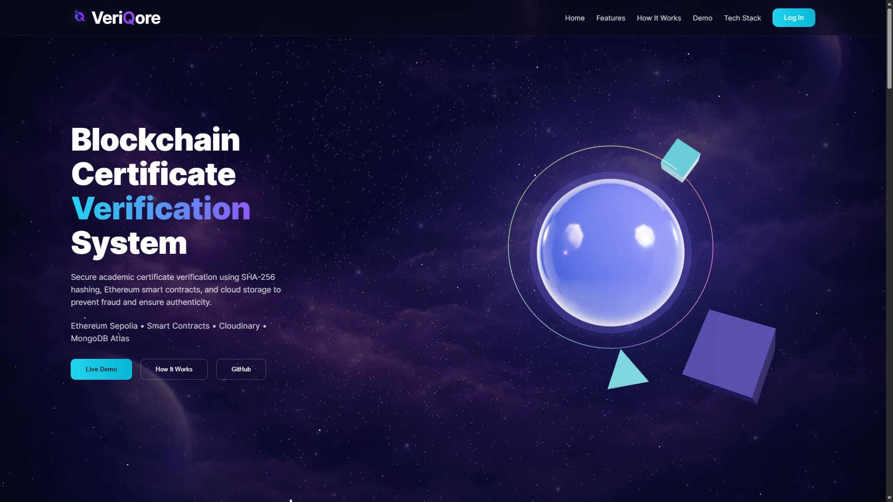

---

## 🏗️ System Architecture


---

## ⭐ Project Highlights

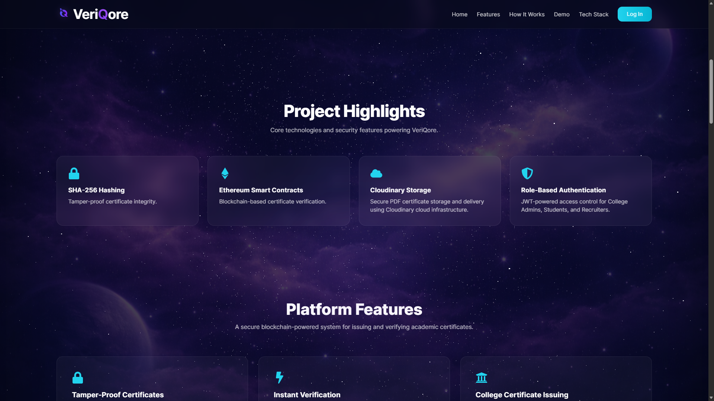

---

## 🚀 Platform Features

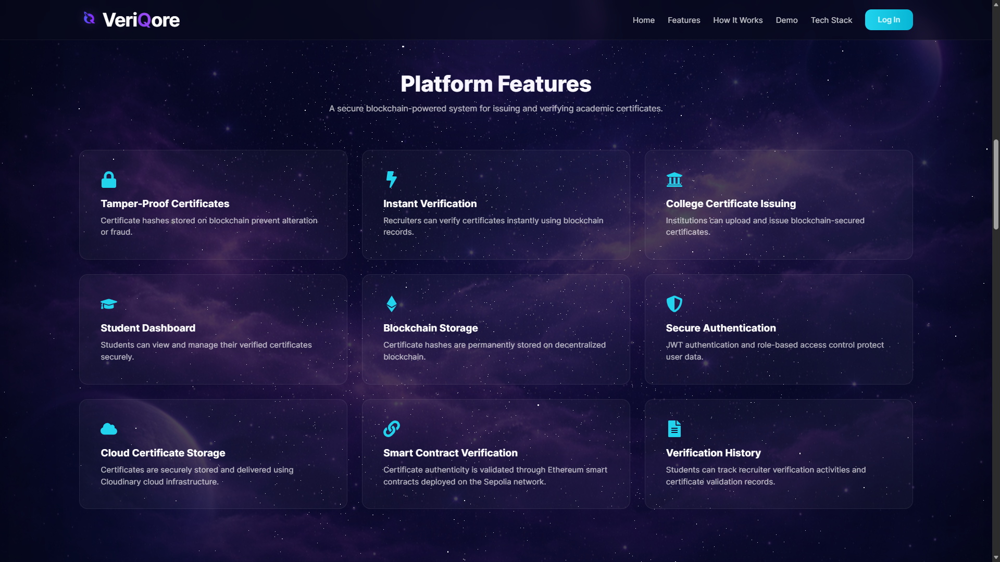

---

## 🔄 How VeriQore Works

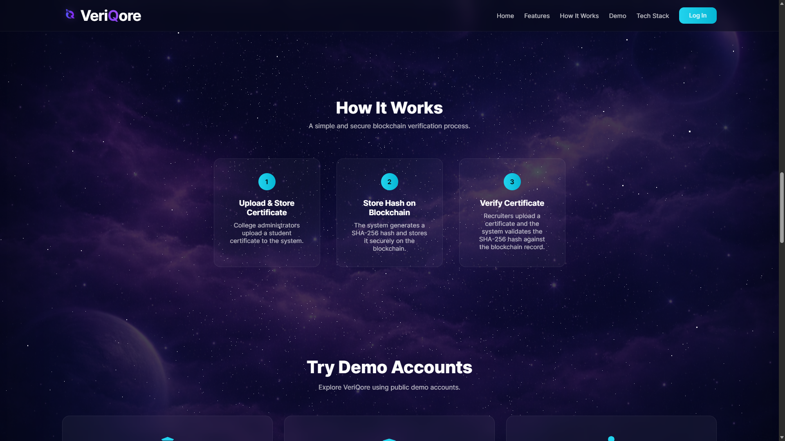

---

## 👥 Demo Accounts

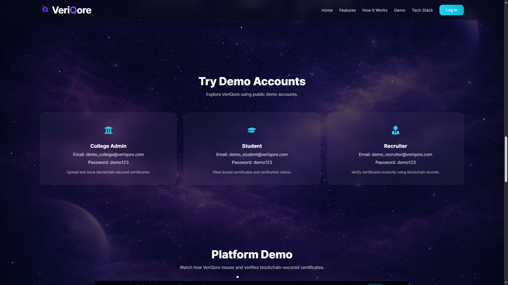

---

## 💻 Technology Stack

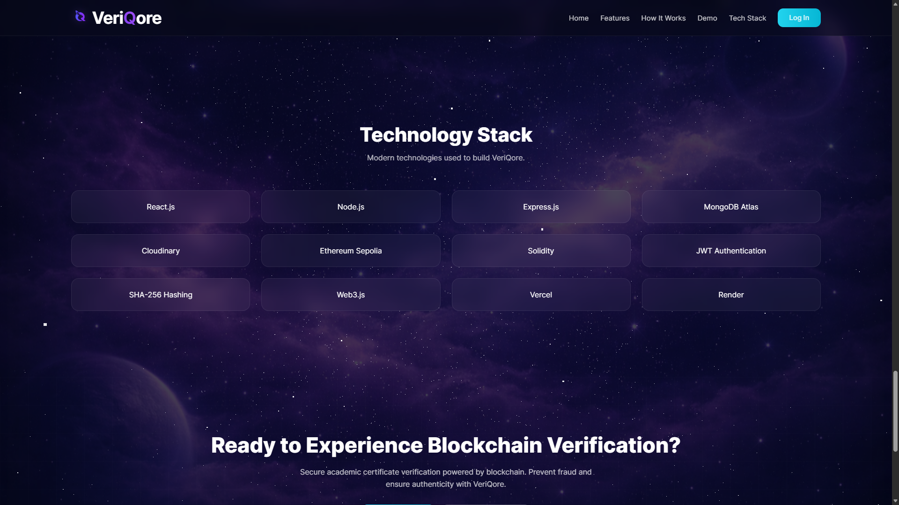

---

## 🔐 Login Page

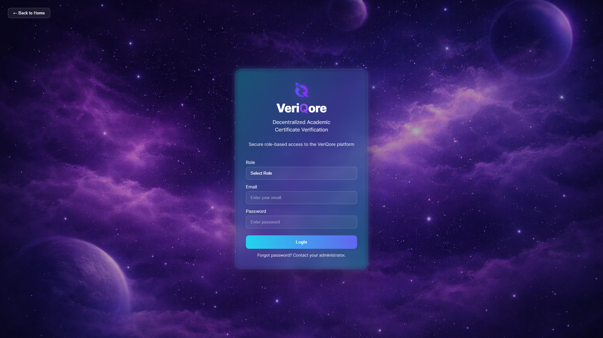

---

## 👑 Master Administrator Dashboard

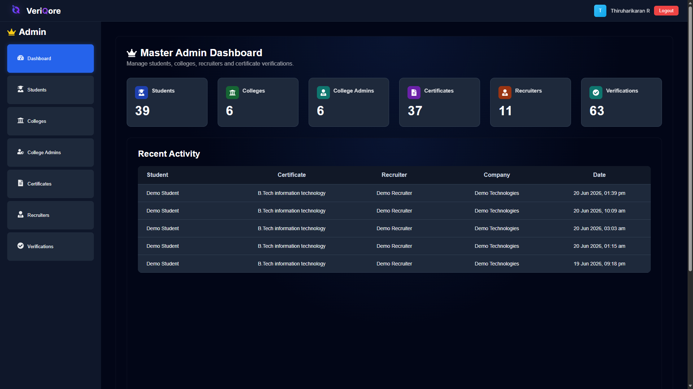

---

## 🏫 College Administrator Dashboard

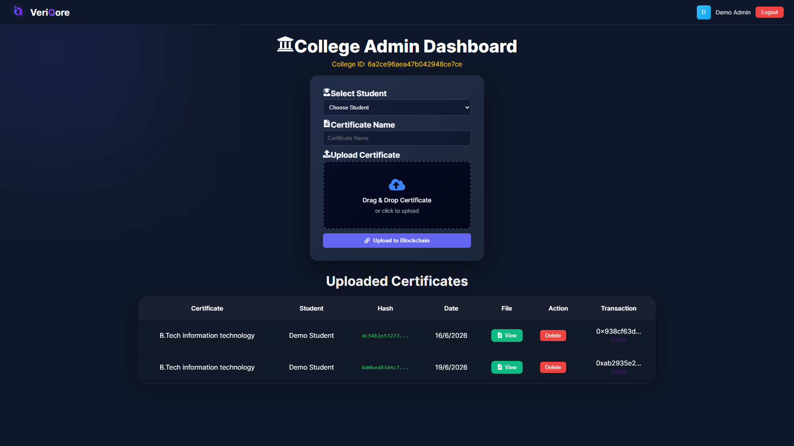

---

## 🎓 Student Dashboard

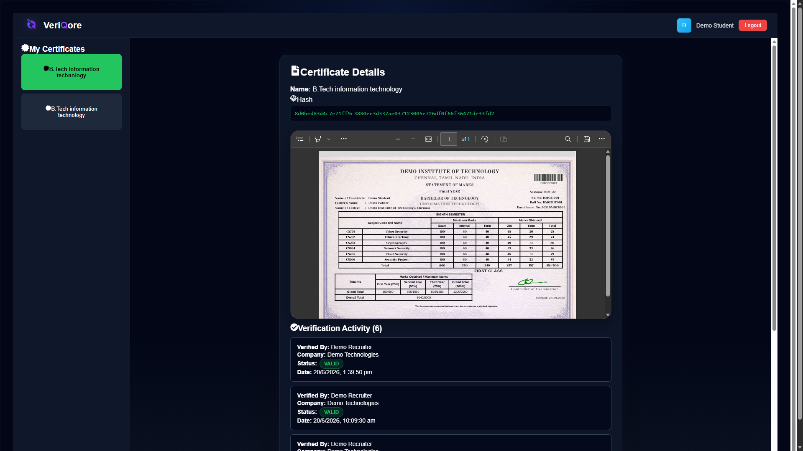

---

## 💼 Recruiter Dashboard

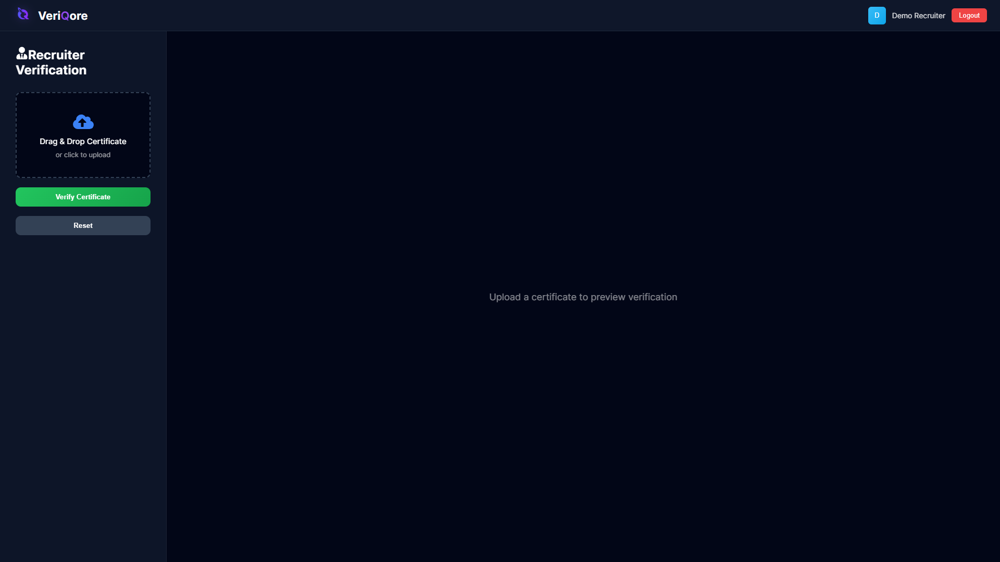

---

## ✅ Certificate Verification Result

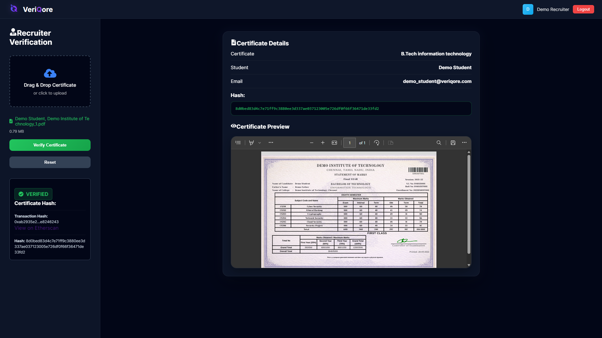

---

## 📜 Verification History

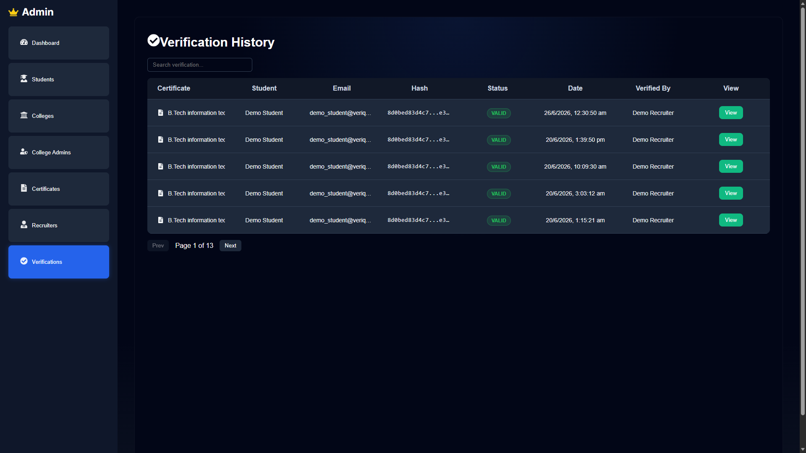

---

## ⛓️ Blockchain Integration

The following screenshots demonstrate the blockchain integration used during certificate issuance, including MetaMask transaction approval and on-chain transaction confirmation on the Ethereum Sepolia test network.

### MetaMask Transaction Approval

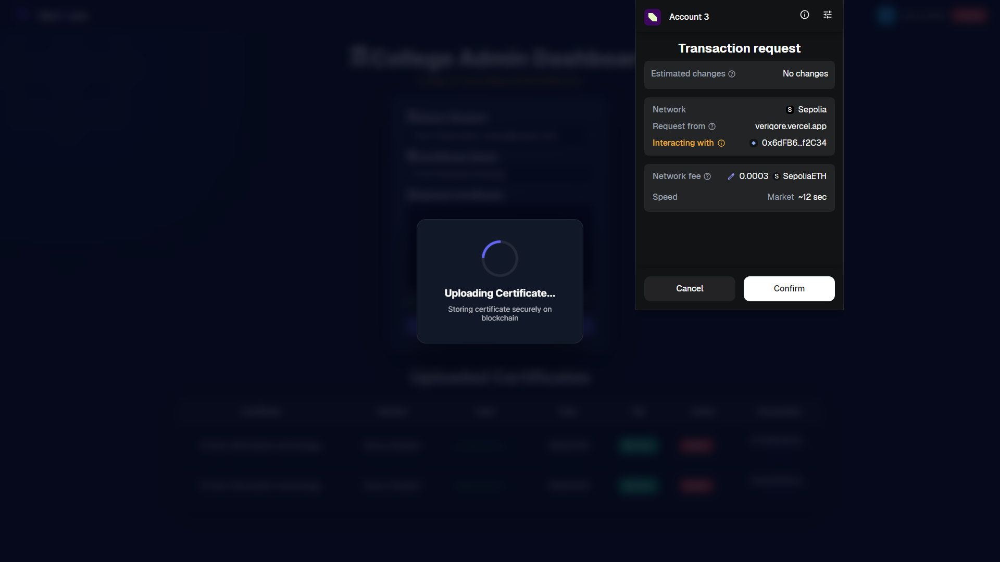

---

### Ethereum Sepolia Blockchain Transaction

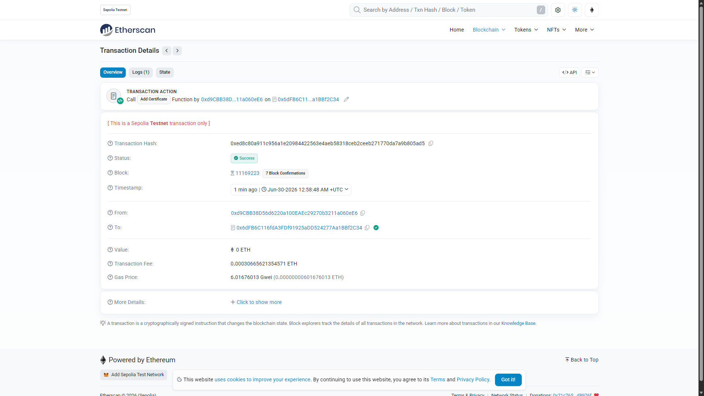

---

## ⚠️ Error Pages


---

# 🛡️ Security Features

## JWT Authentication

Secures user sessions and protects backend API endpoints.

---

## Protected Routes

Restricts unauthorized users from accessing protected resources.

---

## Role-Based Authorization

Permissions are enforced based on the authenticated user's role.

---

## SHA-256 Integrity Verification

Every uploaded certificate receives a unique SHA-256 cryptographic fingerprint.

This allows VeriQore to instantly detect certificate tampering.

---

## Duplicate Certificate Detection

Duplicate certificates are detected before blockchain registration, preventing redundant blockchain transactions and unnecessary gas consumption.

---

## MetaMask Transaction Approval

Every blockchain transaction requires explicit user authorization through MetaMask before being executed.

---

## Blockchain Immutability

Certificate hashes stored on Ethereum Sepolia cannot be modified after blockchain confirmation, providing long-term integrity and transparency.

---

# 💻 Technology Stack

VeriQore is built using a modern full-stack architecture that combines web technologies, blockchain development, cloud storage, and secure authentication.

| Category                     | Technologies                                      |
| ---------------------------- | ------------------------------------------------- |
| **Frontend**                 | React.js, React Router, Axios, Framer Motion, CSS |
| **Backend**                  | Node.js, Express.js                               |
| **Database**                 | MongoDB Atlas                                     |
| **Cloud Storage**            | Cloudinary                                        |
| **Blockchain**               | Ethereum Sepolia                                  |
| **Smart Contract**           | Solidity                                          |
| **Blockchain Communication** | Web3.js                                           |
| **Wallet Integration**       | MetaMask                                          |
| **Authentication**           | JWT (JSON Web Token)                              |
| **Security**                 | SHA-256 Cryptographic Hashing                     |

---

# 🗄️ Database Collections

VeriQore uses MongoDB Atlas to manage application data through the following collections:

| Collection              | Purpose                                                                                         |
| ----------------------- | ----------------------------------------------------------------------------------------------- |
| **Users**               | Stores authentication credentials and role information                                          |
| **Students**            | Stores student profile information                                                              |
| **Colleges**            | Stores registered college details                                                               |
| **Certificates**        | Stores certificate metadata, Cloudinary URLs, blockchain transaction hashes, and SHA-256 hashes |
| **Recruiters**          | Stores recruiter information                                                                    |
| **VerificationHistory** | Stores recruiter verification activities and verification logs                                  |

---

# 📂 Project Structure

```
blockchain-certificate-verification-system
│
├── frontend
│   ├── public
│   ├── src
│   │   ├── api
│   │   ├── assets
│   │   ├── blockchain
│   │   ├── components
│   │   ├── pages
│   │   ├── styles
│   │   ├── App.jsx
│   │   └── main.jsx
│   │
│   ├── package.json
│   └── vite.config.js
│
├── backend
│   ├── auth
│   ├── blockchain
│   ├── config
│   ├── middleware
│   ├── models
│   ├── routes
│   ├── utils
│   ├── uploads
│   ├── server.js
│   └── package.json
│
├── blockchain
│   ├── contracts
│   ├── scripts
│   ├── artifacts
│   ├── cache
│   ├── hardhat.config.js
│   └── package.json
│
├── screenshots
│
└── README.md
```

The project is organized into three major modules:

### Frontend

Responsible for:

- User Interface
- Dashboard Pages
- Routing
- API Communication
- Blockchain Interaction
- Responsive Design

---

### Backend

Responsible for:

- REST APIs
- Authentication
- Authorization
- Certificate Management
- Database Operations
- Blockchain Verification

---

### Blockchain

Responsible for:

- Smart Contract Development
- Certificate Hash Storage
- Blockchain Deployment
- Ethereum Integration

---

# ⚠️ Error Handling

VeriQore includes dedicated error pages to improve usability and user experience.

### 401 Unauthorized

Displayed when an unauthenticated user attempts to access protected resources.

---

### 403 Forbidden

Displayed when an authenticated user attempts to access resources outside their assigned role.

---

### 404 Not Found

Displayed when users navigate to unavailable pages or invalid routes.

---

### 500 Internal Server Error

Displayed when unexpected server-side failures occur.

---

# 🚀 Future Enhancements

Potential future improvements include:

- IPFS Integration for decentralized certificate storage
- QR Code-based Certificate Verification
- Mobile Application
- Multi-University Support
- Decentralized Identity (DID) Integration
- Multi-Language Support
- Email Notification System
- Certificate Expiration Management
- Blockchain Analytics Dashboard

---

# 👨‍💻 Author

## Thiruharikaran R

**Blockchain & Full-Stack Developer**

B.Tech Information Technology

### Areas of Interest

- Full-Stack Web Development
- Blockchain Development
- Smart Contracts
- Web3 Applications
- Cloud Computing
- Secure Software Systems

---

# 📄 Usage Notice

This project was developed for learning, portfolio, and demonstration purposes.

All rights reserved © Thiruharikaran R.

---

# 🎯 Conclusion

VeriQore demonstrates how blockchain technology can be integrated with modern full-stack web applications to build a secure, transparent, and tamper-resistant academic certificate verification platform.

By combining **SHA-256 cryptographic hashing**, **Ethereum blockchain**, **Solidity Smart Contracts**, **Cloudinary cloud storage**, **MongoDB Atlas**, **JWT Authentication**, and **role-based access control**, VeriQore provides a complete end-to-end solution for secure certificate issuance and trusted certificate verification.

The project highlights practical implementation of blockchain technology in real-world educational systems while improving transparency, reducing manual verification efforts, and protecting academic credentials against tampering and forgery.

---

## ⭐ If you found this project interesting, consider giving it a star.

Thank you for visiting the VeriQore repository.
